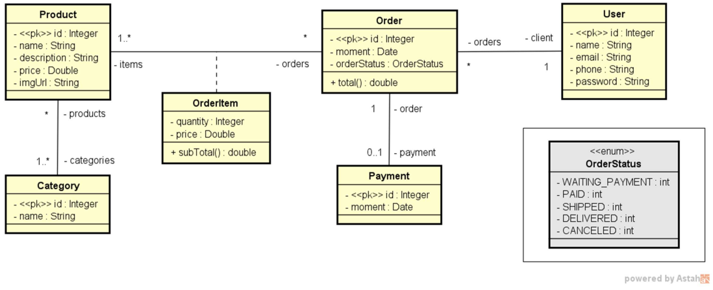

# Projeto - Web services com Spring Boot e JPA / Hibernate
[](https://github.com/Jefersonnnn/workshop-springboot3-jpa/blob/main/LICENSE)

# Sobre o projeto

Este projeto tem como objetivo o aprendizado no desenvolvimento de uma aplicação web usando o Java. 
Acompanhando o curso [Java Completo 2023](https://www.udemy.com/course/java-curso-completo/).

## Objetivos
- Criar projeto Spring Boot Java
- Implementar modelo de domínio
- Estruturar camadas lógicas: resource, service, repository
- Configurar banco de dados de teste (H2)
- Povoar o banco de dados
- CRUD - Create, Retrieve, Update, Delete
- Tratamento de exceções

## Modelo de domínio


# Tecnologias utilizadas
## Back end
- Java 17
- Spring Boot
    - Spring Web
- JPA / Hibernate
- Maven

# Como executar o projeto

## Back end
Pré-requisitos: Java 17

```bash
# clonar repositório
git clone https://github.com/Jefersonnnn/workshop-springboot3-jpa.git

# executar o projeto
./mvnw spring-boot:run
```

# Autor

Jeferson Machado
